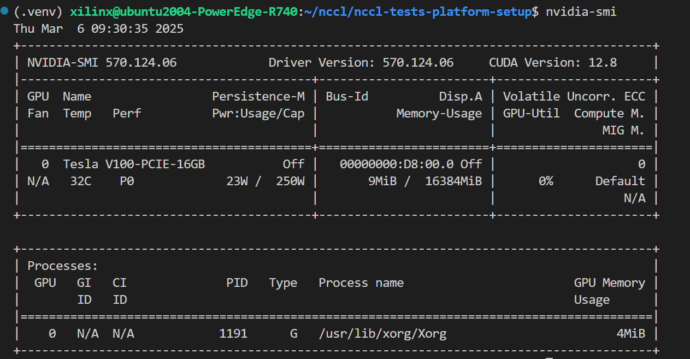
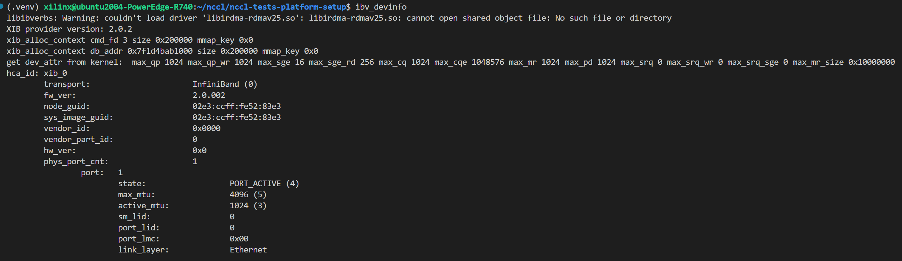

  <!-- toc -->
  
  #  1. setup in the host

  ## 1.1. 使用到的组件
  * GPU DRIVER
  * CUDA
  * NCCL
  * nccl-tests
  * rdma-core
  * U45N rdma driver

  ## 1.2. Clean

  ### 1.2.1. 卸载cuda
  '''  
  sudo apt-get purge cuda-*  
  sudo apt autoremove  
  sudo apt clean
  sudo rm -rf /usr/local/cuda*  
  sudo rm -rf /usr/include/cuda* 

  检查一下还有没有残留的cuda文件    
  ls -l /usr/lib | grep cuda*  
  ls -l /usr/local/ | grep cuda*  
  '''

  ### 1.2.2. 卸载nvidia driver
  '''  
  sudo apt remove --purge '^nvidia-.*'  
  sudo apt autoremove  
  sudo apt clean     
  sudo rm -rf /usr/local/nvidia* 

  检查一下还有没有残留的driver文件  
  ls -l /usr/lib | grep nvidia*  
  ls -l /usr/local/ | grep nvidia*  
  '''

  ### 1.2.3. 卸载nccl
  '''  
  sudo apt-get purge libnccl2 libnccl-dev  
  sudo apt-get purge nccl-tools  

  检查是否卸载成功  
  dpkg -l  | grep nccl
  '''  

  ### 1.2.4. 清除系统中的残余库和头文件
  ''' 
  sudo rm -rf /etc/X11/xorg.conf  
  sudo rm -rf /var/lib/dkms/nvidia*
  ''' 

  ### 1.2.5. 检查环境变量
  '''
  grep -i 'cuda' ~/.bashrc ~/.profile ~/.bash_profile  
  如果仍然有 export PATH=/usr/local/cuda/bin:$PATH  
  或 export LD_LIBRARY_PATH=/usr/local/cuda/lib64:$LD_LIBRARY_PATH  
  手动删除这些行  
  运行 source ~/.bashrc  
  '''
  
  ## 1.3. setup
  ### 1.3.1. 安装driver
  '''  
  参考文档 
  - https://docs.nvidia.com/cuda/cuda-installation-guide-linux/  （TL;TR）  

  根据GPU的型号选择对应的driver版本  
  - https://www.nvidia.com/en-us/drivers/  
  - https://www.nvidia.com/en-us/drivers/unix/ 
   
  例如针对Tesla v100  
  
  Driver Version:	570.124.06  
  Release Date:	Mon Mar 03, 2025  
  Operating System:	Linux 64-bit Ubuntu 22.04  
  CUDA Toolkit:	12.8  
  Language:	English (US)  
  File Size:	492.37 MB  

  wget https://us.download.nvidia.com/tesla/570.124.06/nvidia-driver-local-repo-ubuntu2204-570.124.06_1.0-1_amd64.deb

  sudo cp nvidia-driver-local-repo-ubuntu2204-570.124.06_1.0-1_amd64.deb /tmp/

  sudo apt install /tmp/nvidia-driver-local-repo-ubuntu2204-570.124.06_1.0-1_amd64.deb

  sudo cp /var/nvidia-driver-local-repo-ubuntu2204-570.124.06/nvidia-driver-local-F4FD6868-keyring.gpg /usr/share/keyrings/

  echo "deb [signed-by=/usr/share/keyrings/nvidia-keyring.gpg] file:///nvidia-driver-local-repo-ubuntu2204-570.124.06 ./" | sudo tee /etc/apt/sources.list.d/nvidia-local.list

  sudo apt update

  apt search nvidia-driver   #找到对应的driver版本例如nvidia-driver-570

  sudo apt install nvidia-driver-570
  
  安装完成后重启系统  
  运行nvidia-smi  验证是否安装成功 
  

  ### 1.3.2. 安装cuda
  '''  
  确定和driver匹配的cuda版本  
  - https://docs.nvidia.com/cuda/cuda-toolkit-release-notes/index.html  
  - https://docs.nvidia.com/deploy/cuda-compatibility/  

  下载CUDA TOOlkit Archive的地址  
  - https://developer.nvidia.com/cuda-toolkit-archive  
  最后选择runfile（local  ）

  针对 Driver Version:	570.124.06， 可以查询到CUDA 12.8 GA ----（linux Driver version）>=570.26  

  wget https://developer.download.nvidia.com/compute/cuda/12.8.0/local_installers/cuda_12.8.0_570.86.10_linux.run  
  sudo sh cuda_12.8.0_570.86.10_linux.run

  安装的过程中取消安装驱动  

  ===========  
  1. = Summary =  
  ===========  

  Driver:   Not Selected  
  Toolkit:  Installed in /usr/local/cuda-12.8/  

  Please make sure that  
  -   PATH includes /usr/local/cuda-12.8/bin
  -   LD_LIBRARY_PATH includes /usr/local/cuda-12.8/lib64, or, add /usr/local/cuda-12.8/lib64 to /etc/ld.so.conf and run ldconfig as root  

  To uninstall the CUDA Toolkit, run cuda-uninstaller in /usr/local/cuda-12.8/bin  
  ***WARNING: Incomplete installation! This installation did not install the CUDA   Driver. A driver of version at least 570.00 is required for CUDA 12.8 functionality to work.  
  To install the driver using this installer, run the following command, replacing <CudaInstaller> with the name of this run file:  
      sudo <CudaInstaller>.run --silent --driver  

  Logfile is /var/log/cuda-installer.log  

  安装完成后声明环境变量  
  echo 'export PATH=/usr/local/cuda-12.8/bin:$PATH' >> ~/.bashrc  
  echo 'export LD_LIBRARY_PATH=/usr/local/cuda-12.8/lib64:$LD_LIBRARY_PATH' >> ~/.bashrc  
  source ~/.bashrc  

  安装完成后检查nvcc版本  
  nvcc --version  
  nvcc: NVIDIA (R) Cuda compiler driver  
  Copyright (c) 2005-2025 NVIDIA Corporation  
  Built on Wed_Jan_15_19:20:09_PST_2025  
  Cuda compilation tools, release 12.8, V12.8.61  
  Build cuda_12.8.r12.8/compiler.35404655_0  

  ### 1.3.3. 安装nccl
  '''
  检查使用CUDA12.2的版本，需要查找并安装支持 CUDA 12.2 的 NCCL 版本  
  使用 apt-cache 搜索可用版本  
  apt-cache madison libnccl2   
  libnccl2 | 2.25.1-1+cuda12.8 | https://developer.download.nvidia.com/compute/cuda/repos/ubuntu2204/x86_64  Packages  
  libnccl2 | 2.25.1-1+cuda12.4 | https://developer.download.nvidia.com/compute/cuda/repos/ubuntu2204/x86_64  Packages  
  libnccl2 | 2.25.1-1+cuda12.2 | https://developer.download.nvidia.com/compute/cuda/repos/ubuntu2204/x86_64  Packages  

  找到合适的版本以后，例如2.25.1-1+cuda12.8
  安装指定版本  
  sudo apt install -y libnccl2=2.25.1-1+cuda12.8 libnccl-dev=2.25.1-1+cuda12.8
  
  检查nccl 版本,要保证多有机器上的都相同  
  dpkg -l | grep nccl
  ii  libnccl-dev                                           2.25.1-1+cuda12.8                       amd64        NVIDIA Collective Communication Library (NCCL) Development Files  
  ii  libnccl2                                              2.25.1-1+cuda12.8                       amd64        NVIDIA Collective Communication Library (NCCL) Runtime  

  libnccl2 2.25.1-1+cuda12.8 这个命名格式表示该 NCCL 版本的详细信息：

  解析命名格式  
  libnccl2：NCCL（NVIDIA Collective Communications Library）的共享库包名称，libnccl2 表示它是 NCCL 2.x 版本的运行时库   
  2.25.1：NCCL 的版本号，表示它是 2.25.1 版本  
  -1：打包的版本号，通常用于区分同一 NCCL 版本的不同打包或修订版本（可能包含小修复或调整）  
  +cuda12.8：表示该 NCCL 版本是专门为 CUDA 12.8 版本编译和优化的  
  '''

  ### 1.3.4. 安装 nccl test
  '''
  git clone https://github.com/NVIDIA/nccl-tests.git  
  cd nccl-test  
  make clean  

  编译nccl-test  

  编译nccl-test需要mpi, nccl和cuda的库和头文件路径  

  查询mpi的库和头文件  
  mpicc --show  
  gcc -I/usr/local/include -L/usr/local/lib -Wl,-rpath -Wl,/usr/local/lib -Wl,--enable-new-dtags -lmpi 
  这里显示MPI头文件在 /usr/local/include 库在/usr/local/lib  

  查询nccl的库和头文件  
  sudo updatedb  
  sudo ldconfig  
  locate nccl.h  
  /usr/local/include/nccl.h  
  
  locate libnccl.so  
  /usr/local/lib/libnccl.so  
  /usr/local/lib/libnccl.so.2  
  /usr/local/lib/libnccl.so.2.24.3  

  使用 ldconfig 检查 NCCL 共享库  
  ldconfig -p | grep nccl  
  libnccl.so (libc6,x86-64) => /usr/lib/x86_64-linux-gnu/libnccl.so  
  这表示 libnccl.so 位于 /usr/lib/x86_64-linux-gnu/  

  编译nccl-test  
  export MPI_HOME=/usr/local/  
  export CUDA_HOME=/usr/local/cuda-12.8/  
  export NCCL_HOME=/usr/lib/x86_64-linux-gnu/  
  export NCCL_INCLUDE=/usr/include/  

  make MPI=1 MPI_HOME=$MPI_HOME CUDA_HOME=$CUDA_HOME NCCL_HOME=$NCCL_HOME   CXXFLAGS="-I$MPI_HOME/include -I$NCCL_INCLUDE"

  下载U45N的RDMA安装包  
  build & install rdma driver （具体参考U45N的安装教程） 
  modprobe ib_core  
  insmod linux-drivers/xilinx_pci.ko  
  insmod linux-drivers/s-nic.ko  
  insmod linux-drivers/xilinx_ib.ko dyndbg=+p  

  build rdma-core  
  cd rdma-core  
  ./build.sh  

  安装rdma-core的库到系统  
  cp -rf build/include/* /usr/include/  
  cp -rf build/lib/* /usr/lib64/  
  cp -rf build/lib/* /usr/lib/x86_64-linux-gnu/  
  cp -rf build/bin/* /usr/bin/  

  验证是否成功  
  ibv_devinfo  

   

  ## 1.4. 注意事项
  - 所有机器上的软件硬件版本（包括OS,kernel, 编译器，编译脚本，gpu driver, cuda, nccl, nccl-tests,rdma-core, rdma driver ）必须相同
  - 使用MPIRUN的情况下，所有机器上对应的nccl-tests以及其他使用到的文件和文件夹的位置必须相同
  - 如果发现nccl-tests 中函数执行的行为在两台机器中不同  
        使用ldd检查两边引用的库是否相同  
        sudo updatedb和sudo ldconfig以后使用  locate 检查引用的头文件和库目录是否相同，版本是否一样  
        检查/etc/ld.so.conf、/etc/ld.so.conf.d/ 中的配置一致  
        检查LD_LIBRARY_PATH、C_INCLUDE_PATH 等环境变量，确保编译器和动态链接器的搜索顺序一致  

  
